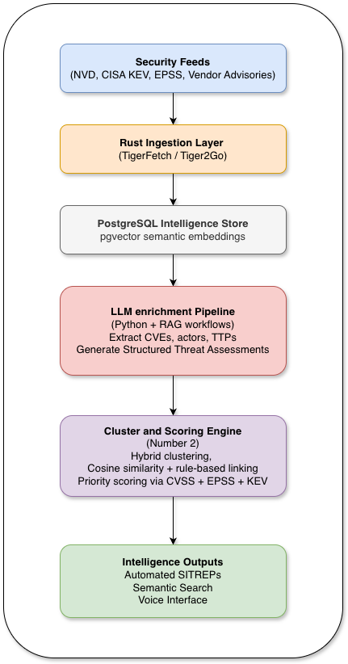
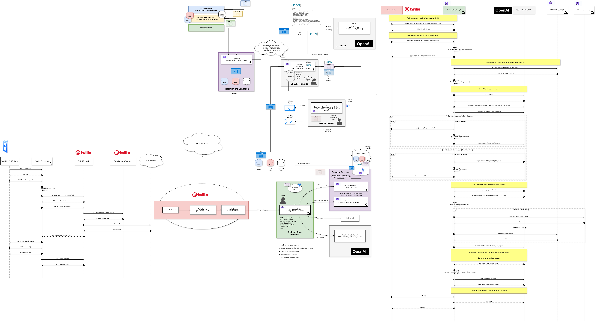
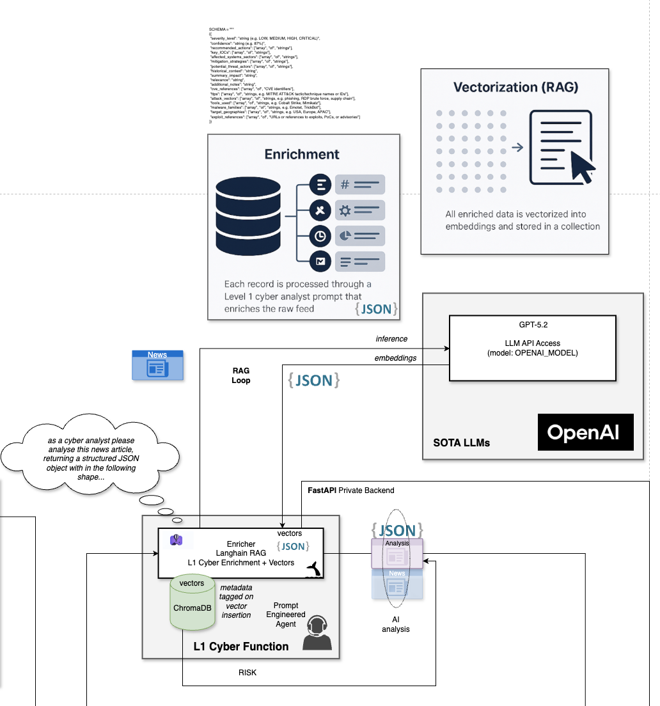
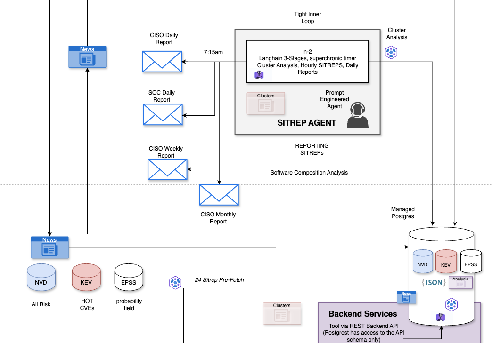

# Mike Harris · miketigerblue

[](https://github.com/miketigerblue)
[](https://github.com/miketigerblue?tab=followers)
[](https://tigerblue.tech)
[](https://www.linkedin.com/in/tigerblue)


## Building an AI-Assisted Threat Intelligence Runtime

Modern threat intelligence suffers from a signal-to-noise problem. Thousands of security events, vulnerabilities, and advisories appear daily across global sources, but analysts must transform these raw signals into actionable intelligence.

To explore this problem, I built a distributed system that treats threat intelligence as a signal-processing pipeline.

The system continuously ingests security feeds, enriches signals using AI analysis, clusters related events, and produces operational threat briefings that can be consumed by humans or automation.

The goal is to explore how modern AI systems can operate as infrastructure components within real-world operational pipelines.

### System Architecture




### Real-Time Voice Interface

One of the system’s experimental interfaces is ODIN, a voice-driven SOC analyst.
A SIP handset connects to an AI system capable of answering security questions and delivering threat briefings in real time.

## Architecture:

```
LAN handset
→ Asterisk PBX
→ Twilio media bridge
→ WebSocket streaming
→ OpenAI realtime models
```

This allows analysts to retrieve intelligence using voice interaction rather than dashboards.

Operational Characteristics
The system runs continuously and processes high-volume security data streams.

### Operational metrics so far:

- 100+ days continuous runtime
- 3,000+ AI-enriched threat analyses
- 4.5 million EPSS records processed
- 1,200+ automated threat SITREPs generated

The stack currently runs across Fly.io infrastructure with PostgreSQL, vector search, and microservices written in Rust, Python, Go, and TypeScript.

### Key Ideas Explored

Treating intelligence as a signal-processing problem
Combining deterministic scoring with LLM analysis
Using vector search to cluster related threat signals
Building conversational interfaces to operational systems


> ### Note 
>    The systems and experiments described here are independent research and personal projects built outside of my employment. They do not represent the work or systems of any current or former employer.

## Current Work

### System Overview


*End-to-end system architecture: feeds -> ingestion -> AI enrichment -> clustering -> SITREP generation -> voice interface.*

### Intelligence Enrichment Pipeline


*LLM-assisted enrichment pipeline converting OSINT feeds into structured CTI.*

### Analyst Output Pipeline


*Clustering and scoring pipeline producing operational SITREPs for analysts and downstream systems.*


I am building a vertically integrated cyber threat-intelligence pipeline designed to ingest raw security signals, enrich them with AI-assisted analysis, and deliver actionable intelligence outputs.

The system treats threat intelligence as a signal-processing problem: ingest authoritative sources, enrich and cluster signals, then deliver intelligence outputs analysts can act on.

### The stack includes:

- **Tigerfetch (Rust)**: ingestion service collecting security feeds such as NCSC, CISA, JPCERT, MISP, Unit 42, Exploit-DB, and others into a PostgreSQL-backed OSINT platform.
- **L1 Cyber Analyst**: AI enrichment pipeline using RAG + LLM analysis to produce structured threat assessments including CVEs, TTPs, actors, IOCs, and recommended actions.
- **Number 2**: clustering engine that groups enriched signals and generates hourly SITREPs using deterministic scoring based on CVSS, EPSS, KEV, and actor behaviour.
- **Project Odin**: voice interface to the threat-intelligence pipeline, a SIP handset connected to an AI SOC analyst capable of delivering SITREPs and performing semantic searches in real time.
- **Tiger2Go**: open-source Go implementation of the ingestion layer designed for high-volume concurrent OSINT ingestion.

### Operational metrics so far:

- **100+ days** continuous operation
- **3,000+** enriched threat analyses
- **4.5M** EPSS records processed
- **1,200+** automated SITREPs generated

---

## Active Projects

| Project | Stack | Status |
|---|---|---|
| **OSINT Platform + L1** | Python · PostgreSQL · ChromaDB · FastAPI · TypeScript · Fly.io | Active |
| [**Project Odin**](https://github.com/miketigerblue/asterisk-twilio-pbx) | Asterisk · Twilio · Node.js · OpenAI Realtime · PostgREST · Fly.io | Active |
| **Number 2** | Python · PostgreSQL · pgvector · OpenAI · PostgREST · Fly.io | Active |
| [**Tiger2Go**](https://github.com/miketigerblue/tiger2go) | Go · PostgreSQL · pgx · Prometheus · goose | Active |

### OSINT Platform + L1

Tigerfetch ingests raw security feeds into a PostgreSQL-backed OSINT platform. L1 Cyber Analyst enriches those signals using RAG + LLM workflows to produce structured assessments covering CVEs, TTPs, actors, IOCs, severity, confidence, and recommended actions.

The goal is to turn high-volume, noisy OSINT into operational CTI that can be searched, clustered, narrated, and consumed downstream by analysts and automation.

Current access layers include a FastAPI API, PostgREST services, semantic search over ChromaDB, and downstream reporting and export paths.

### [Project Odin](https://github.com/miketigerblue/asterisk-twilio-pbx)

A real-time voice interface for cyber threat intelligence.

A human operator picks up a LAN phone, dials an extension, and reaches **ODIN**, an AI-powered SOC analyst capable of delivering live SITREPs, performing semantic searches, and retrieving vulnerability intelligence by voice.

The architecture separates into two planes.

**Voice / SIP plane (latency-critical)**

LAN handsets -> Asterisk PBX -> Twilio -> WebSocket bridge -> OpenAI Realtime API.

The bridge streams G.711 mu-law audio with 20 ms frame pacing and supports barge-in detection, backpressure handling, and gated tool calls.

**Threat-intelligence plane**

RSS feeds + NVD + CISA KEV + EPSS -> ingestion -> enrichment -> clustering -> SITREP generation.

Context is pre-cached to minimise first-audio latency.

The system runs across a Raspberry Pi PBX and Fly.io cloud services.

See the full implementation at [**github.com/miketigerblue/asterisk-twilio-pbx**](https://github.com/miketigerblue/asterisk-twilio-pbx).

### Number 2

Automated SITREP pipeline producing hourly cyber threat-intelligence reports.

Pipeline stages:

- **Extraction**: normalises enriched data into schema-validated intelligence objects.
- **Embedding cache**: vectors stored in pgvector to avoid recomputation.
- **Hybrid clustering**: combines cosine similarity with deterministic rules based on shared CVEs or actors.
- **Scoring**: priority index built from CVSS, EPSS, KEV status, and threat actor behaviour.
- **Narrative generation**: produces concise executive summaries highlighting changes from previous reporting cycles.

Additional capabilities include convergence detection across sector x geography x actor x TTP signals and automated reporting for SOC and CISO audiences.

See the sample report: [**ODIN Threat Landscape Report**](ODIN-TLR-26-Feb--04-Mar-2026.pdf)

### [Tiger2Go](https://github.com/miketigerblue/tiger2go)

Open-source Go port of the Rust ingestion service.

Designed for operational ingestion workloads where concurrency, retries, idempotency, and long-running reliability matter more than memory ownership semantics.

Capabilities include:

- concurrent RSS ingestion
- NVD CVE ingestion
- CISA KEV updates
- EPSS daily score ingestion (~300k records/day)

Operational tooling includes Prometheus metrics and health endpoints.

---

## Tech Stack

### Languages


### Voice & Comms


### Infrastructure & Data


### Security & Intelligence


### Compliance & Audit


---

## Philosophy

I treat intelligence and telemetry systems as signal-processing pipelines: ingest authoritative sources, enrich signals with AI analysis, cluster patterns, and deliver operational outputs


## Career Background

My career began in the early internet era.

I started in **BerMUG** in the late 1980s running a FirstClass BBS federated with global Mac communities.

In 1994 I helped build Bermuda's first commercial ISP, **Internet Bermuda Ltd**, serving as .BM TLD hostmaster and deploying one of the island's first secure online credit-card systems.

Later I became CTO of **Quantum Communications**, launching Bermuda's first metro-Ethernet service, CLEC interconnection, and a national IP/MPLS backbone.

My telecom background also includes work with **Cable & Wireless** and **Logic**, extending that experience across Bermuda's carrier and connectivity landscape.

At **QuoVadis** I designed and delivered a Tier III data centre supporting PKI certificate-authority infrastructure including HSM-backed systems.

I later founded **OnXis**, a security consultancy delivering incident response, digital forensics, and resilience engineering for governments and enterprises.

More recently I worked at **deltaflare**, building DevSecOps pipelines and hardened Linux systems for industrial IoT platforms.

Today I work at **Motion Applied**, engineering secure rail connectivity systems and supporting compliance work across ISO 27001, ISO 9001, ISO 14001, NIS2, and IEC 62443 environments.

---

## Get in Touch

- **LinkedIn:** [linkedin.com/in/tigerblue](https://www.linkedin.com/in/tigerblue)
- **X:** [@miketigerblue](https://x.com/miketigerblue)
- **Email:** mike@tigerblue.tech
- **Blog:** [tigerblue.tech](https://tigerblue.tech/blog)
